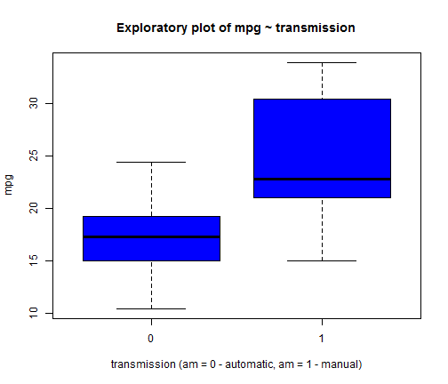
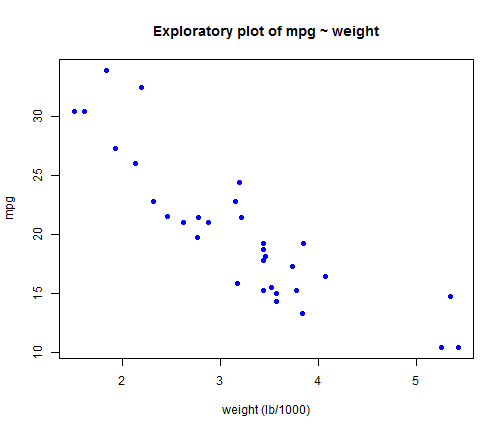
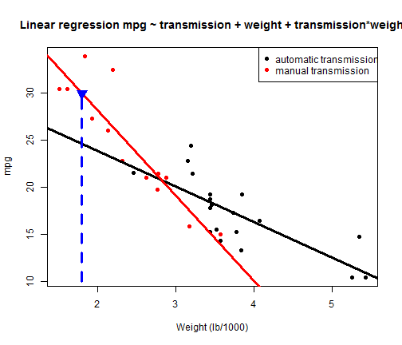

## Car's Explorer Essentials

### *Research question* 

The **Car's Explorer** Shiny application is created to help car's users to investigate the question: "Is an automatic or manual car transmission better for miles per gallon (mpg)?"

### *Data set*

To address this question the Shiny application uses the *mtcars* in  ``` library(datasets)```.

### *Application setup*

The **Car's Explorer** Shiny application has two parts:
 - Part I: **Explore car's mpg** allows the user to explore mpg vs. transmission or weight.
 - Part II: **Predict car's mpg** allows the user to predict mpg for user's choice of transmission and weight.

--- .class #id 

## Part I: Explore car's mpg (mpg ~ transmission)

### **User's input:** transmission (via selectBox)  
### **Shiny app's output:**  the box plot shown below




--- .class #id 

## Part I: Explore car's mpg (mpg ~ weight)

### **User's input:** weight (via selectBox)  
### **Shiny app's output:**  the scatter plot shown below




--- .class #id 

## Part II: Predict car's mpg

### **User's input:** Example: transmission = manual and weight = 1.8
### **Shiny app's output:**  Linear regression model prediction + plot (blue arrow dashed line).
*Predicted mpg for your input of transmission and weight is: 29.94*




